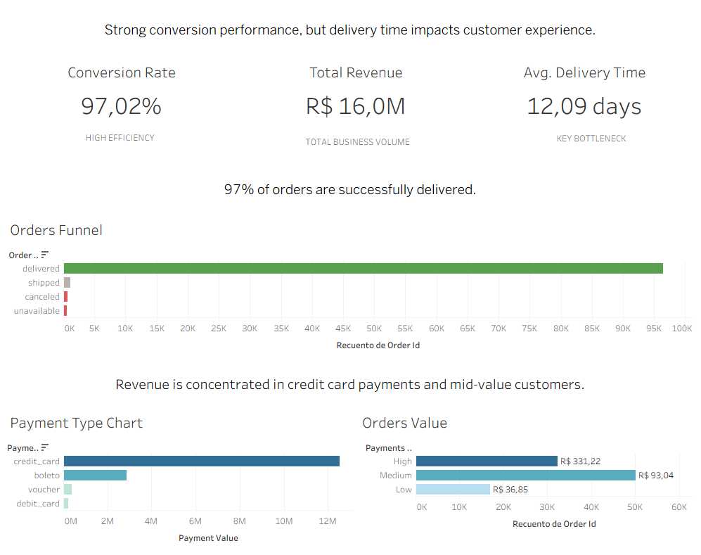

# From conversion to customer experience: E-commerce Analysis

## 📊 Project Overview:

In this project I analyze an e-commerce dataset to understand order conversion, payment performance, revenue distribution, and customer experience. The goal is to identify which areas of the business are already performing well and where the main growth opportunities may lie.

## 🎯 Business Goal:

The goal of this analysis is to evaluate the efficiency of the e-commerce order funnel and detect the main growth opportunities. While conversion performance is important, this project also explores whether customer experience factors such as delivery time may have a stronger long-term impact on growth.

## 📦 Dataset:

The analysis is based on the 'Brazilian e-Commerce public dataset by Olist'. The dataset includes information about orders, payments, products, customers, and delivery dates, making it possible to explore both operational performance and customer-related insights.

Main tables used in this project:

- orders
- order\_payments
- order\_items

## 🛠️ Tools Used:

- SQL (BigQuery) for data exploration and analysis.
- Tableau / Power BI for visualization.
- GitHub for project documentation.

## ❓ Key Questions:

This analysis aims to answer the following questions:

1. How efficient is the order funnel?
2. What percentage of orders are successfully delivered?
3. Are some payment methods associated with higher cancellation rates?
4. Which payment methods generate the highest revenue and average order value?
5. How long does delivery take on average?
6. Which customer/order value segments represent the biggest growth opportunity?
7. Should the business prioritize conversion optimization or customer experience improvements?

## 📈 Analysis Process:

I structured the analysis in multiple steps to progressively move from operational performance to business insights:

1. **Order funnel Analysis:**
   - Measured total orders and successful deliveries.
   - Calculated overall conversion rate to evaluate operational efficiency.
2. **Order status distribution:**
   - Analyzed the distribution of order statuses (delivered, canceled, unavailable, etc.).
   - Identified the proportion of failed orders.
3. **Payment method Analysis:**
   - Evaluated cancellation rates by payment type.
   - Compared total revenue and average order value across payment methods.
4. **Revenue Analysis:**
   - Identified the most valuable payment methods.
   - Measured average order value to understand customer spending behavior.
5. **Delivery time Analysis:**
   - Calculated average delivery time.
   - Assessed its potential impact on customer experience.
6. **Customer value segmentation:**
   - Segmented orders into low, medium, and high-value groups.
   - Identified which segment represents the biggest growth opportunity.

## 🔍 Key Insights:

- The order funnel is highly efficient, with a 97% delivery rate, which indicates a strong operational performance.
- Failed orders (canceled and unavailable) represent a very small percentage (1.2%), suggesting that improving conversion would have limited impact on growth.
- Credit card is the dominant payment method, plus it generates the highest revenue and the highest average order value.
- Voucher shows the lowest average order value and the highest cancellation rate, indicating lower-quality or less committed customers.
- The average delivery time is approximately 12 days, which is relatively high and may negatively affect customer satisfaction and retention.
- The medium-value segment represents the largest share of orders, making it the most impactful segment for revenue optimization.

## 📊 Dashboard

## 💡 Recommendations:

- **Prioritize customer experience improvements: Focus on reducing delivery times to improve satisfaction and increase repeat purchases.
- **Optimize the medium-value segment: Small increases in average order value within this segment could generate significant revenue growth.
- **Encourage high-value payment methods: Promote credit card usage through incentives or UX improvements.
- **Investigate voucher performance: Analyze whether voucher users face friction or represent lower-intent customers.
- **Focus on retention rather than conversion: Given the already high conversion rate, long-term growth is more likely to come from increasing customer lifetime value.

## 🚀 Next Steps:

- Analyze customer retention and repeat purchase behavior.
- Investigate delivery time variability by region or product category.
- Perform cohort analysis to understand long-term customer value.
- Explore A/B testing opportunities for improving user experience and payment flows.

